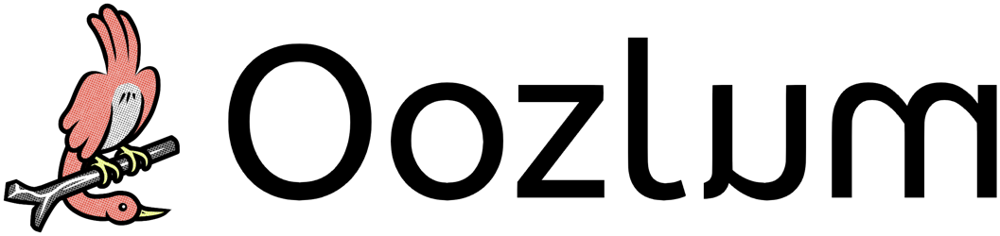

# 

[](https://github.com/urben1680/bevy_oozlum#license)
[](https://crates.io/crates/bevy_oozlum)
[](https://docs.rs/bevy_oozlum/latest/bevy/)

Bevy Oozlum is a crate for [Bevy](https://bevy.org/) to write **reversible systems**, **commands** and **schedules**. It can be useful to implement rewind features in a game that run as smoothly as the normal gameplay.

This crate is not using a snapshot approach and instead reverts to a prior world state by running the backward logic of reversible systems and their commands in reverse order. Because of that, reverting to very distant past world states instantly should probably not be done this way.

"Oozlum" is a mythical bird that is able to fly backwards.

## Example

```rs
use bevy::prelude::*;
use bevy_oozlum::prelude::*;

// reversible system where the logic happens directly in the system
// the RevMeta resource offers methods to inspect and control the global log
fn rev_system_1(meta: Res<RevMeta>) {
    match meta.running_direction() {
        RevDirection::NotLog(_) => println!("hello world! (1)"),
        RevDirection::BackwardLog => println!("!dlrow olleh (1, log)"),
        RevDirection::ForwardLog => println!("hello world! (1, log)")
    }
}

// reversible system where the logic happens in commands
// the NotLog system param makes this system only run during RevDirection::NotLog
fn rev_system_2(not_log: NotLog, mut commands: Commands) {
    commands.queue(|_: &mut World| println!("hello world! (2)"));
    let mut rev_commands = commands.as_rev(not_log);
    rev_commands.queue_undo_redo(|_: &mut World, direction| match direction {
        UndoRedoDirection::Undo => println!("!dlrow olleh (2, log)"),
        UndoRedoDirection::Redo => println!("hello world! (2, log)"),
    });

    // common reversible commands define both the "doing" and undo-redo in one:
    /*
    let rev_entity_commands = rev_commands.rev_spawn(MyComponent);
    */
}

fn input_system(
    keyboard_input: Res<ButtonInput<KeyCode>>,
    mut commands: Commands
) {
    if keyboard_input.just_pressed(KeyCode::ArrowUp) {
        // truncates too-old past frames and all future frames from the log
        commands.queue(RevQueue::RunNotLog);
    } else if keyboard_input.just_pressed(KeyCode::ArrowLeft) {
        // undoes frames, pauses at past log end
        commands.queue(RevQueue::RunBackwardLog);
    } else if keyboard_input.just_pressed(KeyCode::ArrowRight) {
        // redoes frames, pauses at future log end
        commands.queue(RevQueue::RunForwardLog);
    } else if keyboard_input.just_pressed(KeyCode::Down) {
        // do not run reversible schedules and their systems until unpaused
        commands.queue(RevQueue::Pause);
    }
}

App::new()
    .add_plugins((
        DefaultPlugins,
        RevPlugin.set_max_past_len(5) // set amount of frames one can reverse to 
    ))
    .rev_add_systems(
        RevUpdate, // main reversible schedule, by default ran from FixedUpdate
        // the order including commands is reversed at RevDirection::BackwardLog
        (rev_system_1, rev_system_2).rev_chain()
    )
    .add_systems(PreUpdate, input_system)
    .insert_resource(Time::<Fixed>::from_seconds(0.5))
    .run();
```

A bigger example `game` is available that showcases the most important API additions in the `row` module.

See the crate's documentation to learn more of the features and limitations.

## Limitations

The following bevy features are currently not available as reversible variants:

- Change detection via `Tick`s or query filters using them
- Exclusive systems
- Hooks and observers, though both may queue reversible commands
- Many commands are available but not all, like those for dynamic components or cloning entities *
- Delayed commands
- Commands working with `Relationship`(`Target`) that have additional fields *
- Disabling automatically inserted sync points of reversible schedules
- Hotpatching reversible systems is supported but this is not reversible *

<sub>* because this is currently out of scope, but may be implemented manually by the user</sub>

This list may be incomplete.

## Warning

This crate is experimential and may be discontinued at any time.

## Supported bevy version

| Bevy Oozlum | Bevy |
| - | - |
| 0.1.0-rc.1 | 0.19.0-rc.1 |

## License

This crate aligns with bevy's licensing:

* MIT License ([LICENSE-MIT](LICENSE-MIT) or [http://opensource.org/licenses/MIT](http://opensource.org/licenses/MIT))
* Apache License, Version 2.0 ([LICENSE-APACHE](LICENSE-APACHE) or [http://www.apache.org/licenses/LICENSE-2.0](http://www.apache.org/licenses/LICENSE-2.0))
